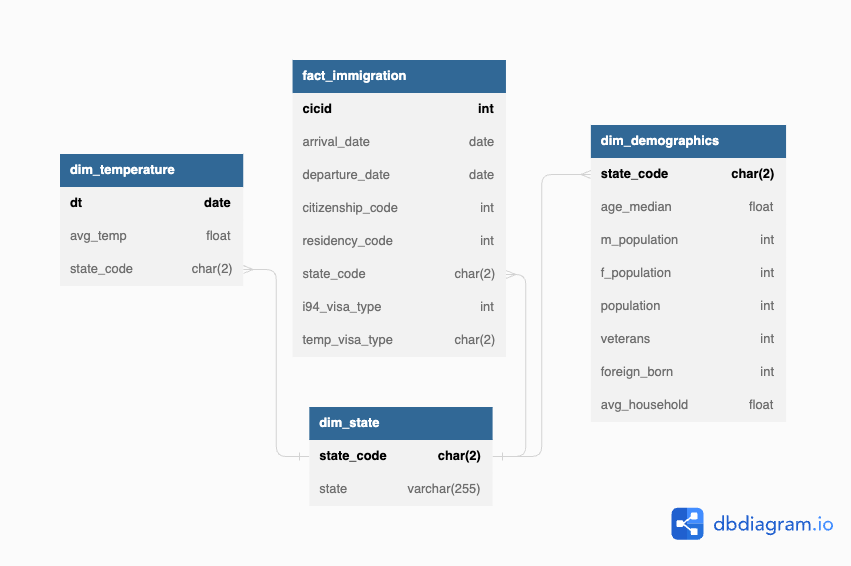

# Data Engineering Capstone Project

### Overview
The purpose of the data engineering capstone project is to combine what you've learned throughout the program. This project will be an important part of your portfolio that will help you achieve your data engineering-related career goals.

I will be assuming I am working as a data engineer for a company building a web platform for the people interested in moving to US.
My team is working on a project to prepare statistical data showing correlation between the climate of US states and origin of the expats who have moved to there, and change of this data by time.

I will prepare a Data Lake for the Data Scientist and Analysits where the data is flexible enough to work with differents use cases in the scope of the project and clean enough to eliminate unneccesary work and use of resources.

The project follows the follow steps:
* Step 1: Scope the Project and Gather Data
* Step 2: Explore and Assess the Data
* Step 3: Define the Data Model
* Step 4: Run ETL to Model the Data
* Step 5: Complete Project Write Up

### Step 1: Scope the Project and Gather Data

#### Scope 
I will prepare a Data Lake for the Data Scientist and Analysits where the data is flexible enough to work with differents use cases in the scope of the project and clean enough to eliminate unneccesary work and use of resources.

The data will be residing in Amazon S3, staged and transformed with Apache Spark on Amazon EMR clusters by PySpark and then loaded into Relational PostgreSQL tables. The tools can be expanded with Apache Airflow to work on the data with iterations, and schedule the pipeline in case the process will be updating with further up to date data.

#### Describe and Gather Data

There will be 4 different data sources used:
- i94 Immigration Data [https://travel.trade.gov/research/reports/i94/historical/2016.html]
- US Cities: Demographics [https://public.opendatasoft.com/explore/dataset/us-cities-demographics/table/]
- Climate Change: Earth Surface Temperature Data [https://www.kaggle.com/datasets/berkeleyearth/climate-change-earth-surface-temperature-data]
- US States and State Codes

Note: The data is assumed to be in S3 buckets, however, due to some problems in workspace, it will be consumed directly from workspace folders.

### Step 2: Explore and Assess the Data

#### Explore the Data 
The arrival and departure date in i94 Immigration Data is not human readable, therefore we can convert it to Pandas datetime. I have provided a clean-up script for that, however I will do it on the fly during transform stage by using SQL functions.

#### Cleaning Steps
- During the describe step, it is identified that some source csv files do not have a header, or there are missing columns or unformatted. Before to continue next steps, the data should be properly formatted.
- The data should be checked for null values for non-null planned columns. For my data, there wasn't any issue with null fields.

### Step 3: Define the Data Model

#### 3.1 Conceptual Data Model
The conceptual data model diagram is added below.

I have decided to use a Relational Data model considering the data is quite flat, we won't need to apply joins a lot, also the data is well structured and unexpected to be changed frequently.

We have 1 fact table: immigration, and 3 dimention tables: temperature, demographics, state.

- Immigration table is extracted from i94 Immigration data, the unneccsary columns are left out.
- Temperature table is extraction of Climate Change: Earth Surface Temperature Data, filtered based on US states.
- Demographics table is extracted from US Demographics data. The data is grouped by state, as we don't need specific city data.
- State_population table is basically a mapping between US state codes and names. Provided to add easy-to-read - representation for state codes.

#### 3.2 Mapping Out Data Pipelines
- Read data from S3 and stage into Dataframes in PySpark.
- Create temporary view for tables in PySpark.
- Extract and transform staged data and load into sql tables in parquet format.
- Optional: Load parquet files to PostgreSQL tables with a db driver like SQLAlchemy in Python.

### Step 4: Run Pipelines to Model the Data

#### 4.1 Create the data model
Build the data pipelines to create the data model.
See Jupyter Notebook.

#### 4.2 Data Quality Checks
Run Quality Checks.
See Jupyter Notebook

#### fact_immigration
| Column Name      | Data Type | Description                                            |
|------------------|-----------|--------------------------------------------------------|
| cicid            | int       | Primary key representing the unique immigration ID      |
| arrival_date     | date      | Date of arrival in the destination country              |
| departure_date   | date      | Date of departure from the destination country          |
| citizenship_code | int       | Code representing the citizenship of the individual     |
| residency_code   | int       | Code representing the residency status of the individual|
| state_code       | char(2)   | Code representing the state within the destination country|
| i94_visa_type    | int       | Code representing the type of visa                      |
| temp_visa_type   | char(2)   | Temporary visa type                                     |
#### dim_demographics
| Column Name    | Data Type | Description                                               |
|----------------|-----------|-----------------------------------------------------------|
| state_code     | char(2)   | Primary key representing the state code                    |
| age_median     | float     | Median age of the population in the state                  |
| m_population   | int       | Total male population in the state                         |
| f_population   | int       | Total female population in the state                       |
| population     | int       | Total population in the state                              |
| veterans       | int       | Number of veterans in the state                            |
| foreign_born   | int       | Number of foreign-born residents in the state              |
| avg_household  | float     | Average household size in the state                        |
#### dim__temperature
| Column Name | Data Type | Description                                        |
|-------------|-----------|----------------------------------------------------|
| dt          | date      | Primary key representing the date                   |
| avg_temp    | float     | Average temperature for the given date              |
| state_code  | char(2)   | Code representing the state within the temperature data |
#### dim_state
| Column Name | Data Type | Description                                          |
|-------------|-----------|------------------------------------------------------|
| state_code  | char(2)   | Primary key representing the state code               |
| state       | varchar(255) | Name of the state                                    |

#### Step 5: Complete Project Write Up

* Clearly state the rationale for the choice of tools and technologies for the project.
* Propose how often the data should be updated and why.
* Write a description of how you would approach the problem differently under the following scenarios:
 * The data was increased by 100x.
 * The data populates a dashboard that must be updated on a daily basis by 7am every day.
 * The database needed to be accessed by 100+ people.
As I have better understanding of Relational DBs and as explained above, it is better suited for my data, I have chosen an SQL based approach. The data is already big, therefore parallel processing with Spark was important.
Data can be updated per year, as the source data includes governmental information, these kind of sources are provided only once a year. Also, the information we want to provide is not time-crucial, it is mostly historical data.
The data was increased by 100:
- I would use larger machines on EMR cluster, look for better partitioning methods(e.g., month-year could be kept on Immigration data for partitioning, use better suited small data types instead of using auto-inferred PySpark data types.
The data populates a dashboard that must be updated on a daily basis by 7am every day.
- We can use Apache Airflow to schedule the jobs daily by 7am. All the methods can be written with Airflow operators or hooks. 
The database needed to be accessed by 100+ people.
- I would still use an RDBMS like PostgreSQL to supply ACID transactions for data integrity.